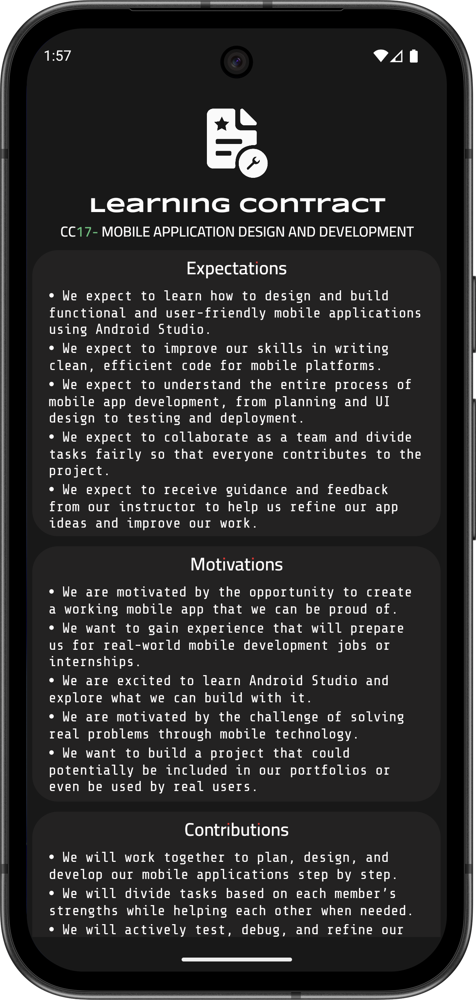

# 📱 Learning Contract Application

This is a static Android application built using **Android Studio**.  
It is currently available for download as a release APK from the **Releases** section.


---
## 📸 Screenshots

<span/>

---
## 📦 Installation
1. Go to the [Releases](../../releases) page of this repository.  
2. Download the latest `app-release.apk`.  
3. Transfer it to your Android device.  
4. Enable **Install from Unknown Sources** (if not already enabled).  
5. Open the APK file and install the app.

---

## 🛠️ Development

This project was built with:
- 
- 
- 

---
##To build this project locally:

```bash
# Clone the repository
git clone https://github.com/<your-username>/<your-repo-name>.git

# Open the project in Android Studio
# Build > Generate Signed Bundle / APK > APK
```

